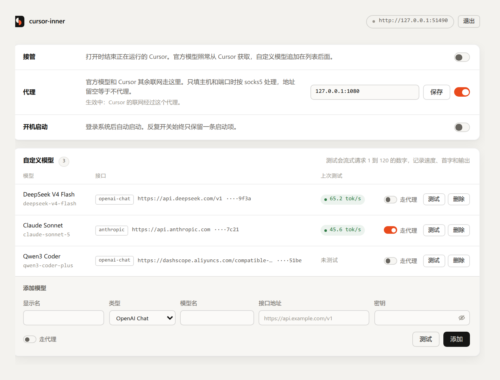
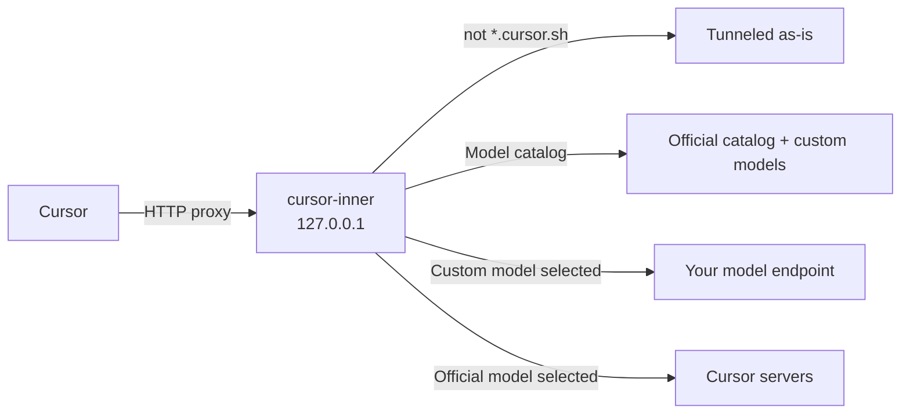

<div align="center">


# cursor-inner

Bring your own model endpoints into Cursor, alongside the official models.

[](https://github.com/CSGrandeur/cursor-inner/releases)
[](#installation)
[](go.mod)
[](LICENSE)

[简体中文](README.md) · **English**

</div>

<picture>
  <source media="(prefers-color-scheme: dark)" srcset="docs/images/web-dark.png">
  
</picture>

## Overview

cursor-inner is a local tool for Cursor on Windows, macOS and Linux. The settings page is available in English and Chinese; use the 中文 / EN button in its top-right corner. It runs a proxy on your machine that decrypts only `*.cursor.sh` traffic, and appends the OpenAI Chat or Anthropic compatible endpoints you configure to the end of Cursor's model list. When you pick one of those models in Cursor, your machine calls your endpoint directly. When you pick an official model, the request goes to Cursor unchanged.

## Features

- **Custom models**: OpenAI Chat Completions and Anthropic Messages endpoints. Add, test and delete them on the settings page.
- **Official models untouched**: the model catalog is only appended to, never replaced. Requests for official models are not modified, apart from going through your outbound proxy.
- **Connectivity test**: streams the numbers 1 to 120 and records tokens/s, time to first token, total duration and output tokens. The last result is saved with the model.
- **Outbound proxy**: route all of Cursor's network traffic through a socks5 or http proxy. Each custom model decides on its own whether to use it.
- **Takeover and restore**: on start, writes Cursor's proxy settings and closes Cursor. On normal exit, closing the terminal, a crash, or a forced kill, the settings are removed and Cursor is closed. Your own `http.proxy`, `http.noProxy` and related Cursor settings are restored to their original values.
- **Start at login**: a logon task on Windows, a LaunchAgent on macOS, an XDG autostart entry on Linux. Toggling it repeatedly always leaves exactly one entry.
- **Single instance**: launching it again shows a notice and opens the existing settings page.

## How it works



On takeover, cursor-inner edits Cursor's `settings.json`: `http.proxy` points at the local proxy, `http.proxySupport` is set to `override`, and HTTP/2 is disabled. Existing values of these keys are backed up first and written back on restore.

The local proxy decrypts only connections to `*.cursor.sh`; everything else is tunneled directly. Chat requests are routed by model id: ids that belong to a custom model are handled locally, everything else is forwarded to Cursor unchanged.

## Installation

**macOS / Linux**

```bash
curl -fsSL https://raw.githubusercontent.com/CSGrandeur/cursor-inner/main/install.sh | sh
```

**Windows** (PowerShell)

```powershell
irm https://raw.githubusercontent.com/CSGrandeur/cursor-inner/main/install.ps1 | iex
```

The installer detects your OS and CPU, downloads the latest release, verifies it against the release's `SHA256SUMS.txt`, and installs it for the current user without administrator rights:

| Platform | Installed to | How to start |
| --- | --- | --- |
| Windows | `%LOCALAPPDATA%\Programs\cursor-inner\` | cursor-inner in the Start menu |
| macOS | `~/.local/bin/cursor-inner` | Run `cursor-inner` in Terminal |
| Linux | `~/.local/bin/cursor-inner` | cursor-inner in the app menu, or run it in a terminal |

Files fetched by the installer carry no browser download mark, so Windows SmartScreen and macOS Gatekeeper do not block them. Set `CURSOR_INNER_VERSION=v0.1.0` to install a specific version.

### First run: trusting the local certificate

On first takeover, cursor-inner generates a root certificate, "cursor-inner Local CA", that exists only on your machine, and asks the system to trust it. Without that trust, Cursor cannot connect through the local proxy.

| Platform | What you will see |
| --- | --- |
| Windows | A prompt asking whether to install the certificate; choose Yes |
| macOS | A request for your login password to add the certificate to the login keychain as trusted |
| Linux | A polkit dialog; after you authorize, the certificate goes into the system store, and `certutil` is installed in the same step if it is missing |

On Linux the certificate goes into two places: the system store and the NSS user database `~/.pki/nssdb`. The system store is supported on Debian / Ubuntu, Fedora / RHEL, openSUSE and Arch and other p11-kit distributions. Without a desktop session or `pkexec`, the settings page and the console show a `sudo` command you can copy and run. Closing Cursor uses `pgrep` / `pkill` (procps, normally preinstalled).

### Manual download

You can also download from [Releases](https://github.com/CSGrandeur/cursor-inner/releases):

| Platform | File |
| --- | --- |
| Windows 10 / 11 | `cursor-inner-<version>-windows-amd64.exe` |
| macOS (Apple silicon / Intel) | `cursor-inner-<version>-darwin-arm64.tar.gz` / `darwin-amd64.tar.gz` |
| Linux (x86_64 / ARM64) | `cursor-inner-<version>-linux-amd64.tar.gz` / `linux-arm64.tar.gz` |

Files downloaded in a browser carry a download mark. On Windows, when SmartScreen appears, click "More info" → "Run anyway"; on macOS, run `xattr -d com.apple.quarantine cursor-inner` before starting it.

## Usage

1. Run cursor-inner. It closes any running Cursor and opens the settings page in your browser.
2. Add a model on the settings page: display name, type, model name, endpoint URL and API key. Click Test to check that it works.
3. Reopen Cursor, start a new chat, and pick the model you added from the model list.
4. When you are done, close the terminal window or click Quit on the settings page; Cursor's settings are restored automatically.

> [!IMPORTANT]
> With **Auto** selected, Cursor only uses official models. Select a custom model explicitly to use it.

## Console window

The settings page URL stays pinned at the top of the console window and is never scrolled away by logs. In terminals that support hyperlinks (Windows Terminal, iTerm2, GNOME Terminal and others), Ctrl+click or Cmd+click the URL to open it.

```text
 ▌▐ cursor-inner v0.1.0   http://127.0.0.1:52341   Ctrl+单击打开配置页
    接管 ● 接管中    出站 socks5://127.0.0.1:1080    自定义模型 3
──────────────────────────────────────────────────────────────────────
20:31:07  接管代理 http://127.0.0.1:61022
20:31:07  已结束 Cursor，重新打开后生效
20:32:15  BidiAppend 3f2a9c… 模型 a1b2c3d4e5f60718 -> 本地
20:32:15  RunSSE 3f2a9c… 由本地模型 DeepSeek V4 Flash 回答
```

| Flag | Effect |
| --- | --- |
| `--no-takeover` | Starts only the settings page, without touching Cursor's settings or closing Cursor. For debugging. |

## Data and privacy

| Platform | Data directory |
| --- | --- |
| Windows | `%APPDATA%\cursor-inner\` |
| macOS | `~/Library/Application Support/cursor-inner/` |
| Linux | `~/.config/cursor-inner/` (or `$XDG_CONFIG_HOME/cursor-inner/`) |

| File | Contents |
| --- | --- |
| `config.json` | Toggles, proxy address, custom models and their last test results. **API keys are stored in plain text.** |
| `ca/` | Root certificate and private key generated on this machine |
| `cursor-settings.backup.json` | Backup of Cursor's original proxy settings during takeover; removed after restore |
| `inner.log` | Routing log for the current run, rewritten on every start. Contains no chat content or keys. |
| `watch.log` | Record of automatic restores after an abnormal exit |
| `takeover.on`, `listen.url`, `instance.lock` | Takeover marker, current settings page URL, single-instance lock |

cursor-inner collects no data: no telemetry, analytics or update checks. The settings page and the local proxy listen on `127.0.0.1` only. Chat content travels only between Cursor, your machine and the model endpoints you configure.

## Uninstall

1. If you enabled start at login, turn it off on the settings page. Then click Quit; Cursor's settings are restored automatically.
2. Remove the root certificate:

   | Platform | Command |
   | --- | --- |
   | Windows | `certutil -user -delstore Root "cursor-inner Local CA"` |
   | macOS | `security delete-certificate -c "cursor-inner Local CA" ~/Library/Keychains/login.keychain-db` |
   | Linux (NSS) | `certutil -d sql:$HOME/.pki/nssdb -D -n "cursor-inner Local CA"` |
   | Debian / Ubuntu | `sudo rm /usr/local/share/ca-certificates/cursor-inner.crt && sudo update-ca-certificates --fresh` |
   | Fedora / RHEL | `sudo rm /etc/pki/ca-trust/source/anchors/cursor-inner.pem && sudo update-ca-trust` |
   | Arch and others | `sudo trust anchor --remove ~/.config/cursor-inner/ca/ca.crt` |

3. Delete the data directory and the program file. If you used the installer, also delete `cursor-inner.lnk` from the Start menu (Windows), or `~/.local/share/applications/cursor-inner.desktop` and `~/.local/share/icons/hicolor/scalable/apps/cursor-inner.svg` (Linux).

## Limitations

- Custom models currently return text only and do not run tool calls. Use an official model when Agent mode needs to edit files or run commands.
- Tab completion and other features are still served by Cursor.
- If a Cursor update changes its internal protocol, custom models may stop working until cursor-inner is updated. Official models are not affected.
- Release binaries are not code-signed. The installer avoids system prompts; browser downloads need to be allowed as described above.
- Console messages are currently Chinese only.

## Building from source

Requires Go 1.26 or later.

```bash
./build.sh windows                   # writes dist/cursor-inner.exe
./build.sh darwin arm64              # writes dist/cursor-inner-darwin-arm64
./build.sh linux amd64               # writes dist/cursor-inner-linux-amd64
VERSION=v0.1.0 ./build.sh windows    # stamps a version
go test ./...
```

For Windows amd64 builds, `build.sh` installs [rsrc](https://github.com/akavel/rsrc) to embed the icon into the exe.

| Script | Purpose |
| --- | --- |
| `scripts/make_icon.py` | Generates `assets/icon.svg` and `assets/icon.ico`; requires Pillow and ImageMagick |
| `scripts/gen_notices.sh` | Generates `THIRD_PARTY_NOTICES.md` from the built binary |

Pushing a `v*` tag makes GitHub Actions test, build all five platform targets and publish a release.

## Project layout

```text
cmd/cursor-inner/      Entry point: single instance, flags, dialogs, exit cleanup
internal/
├── agent/             Decides per model id whether a chat runs locally or upstream
├── app/               Operations behind the settings page
├── autostart/         Start at login: Windows logon task, macOS LaunchAgent, Linux XDG autostart
├── catalog/           Entries appended to Cursor's model catalog
├── config/            Reads and writes config.json
├── console/           Pinned console header and log output
├── cursorsettings/    Edits and restores Cursor's settings.json
├── dialer/            Direct or socks5 / http proxied dialing
├── i18n/              Bilingual (Chinese / English) text for the settings page
├── mitm/              Local proxy: decrypts *.cursor.sh and routes requests
├── protox/            Connect frames and protobuf field encoding
├── provider/          Calls OpenAI Chat / Anthropic endpoints
├── takeover/          Takeover and restore, root certificate, closing Cursor, exit watchdog
└── web/               Settings page and HTTP API
assets/                Icon
install.sh             macOS / Linux installer
install.ps1            Windows installer
scripts/               Icon and third-party notice generators
```

## Acknowledgements

- [cursor-byok](https://github.com/leookun/cursor-byok): cursor-inner's handling of the Cursor protocol is based on its design.
- [goproxy](https://github.com/elazarl/goproxy), [gjson / sjson](https://github.com/tidwall/sjson) and the Go extended libraries.

License texts of all dependencies are in [THIRD_PARTY_NOTICES.md](THIRD_PARTY_NOTICES.md).

## Disclaimer

cursor-inner is an independent third-party project. It is not affiliated with, endorsed by, or authorized by Anysphere, Inc., the maker of Cursor. "Cursor" is a trademark of its owner.

This tool uses a local proxy to modify the model list received by the Cursor client and to intercept chat requests when a custom model is selected. This may not comply with Cursor's Terms of Service. You are responsible for reading and following the terms of Cursor and of the model providers you use, and for any consequences such as account restrictions. The software is provided "as is", without warranty of any kind.

## License

[MIT](LICENSE) © 2026 CSGrandeur
