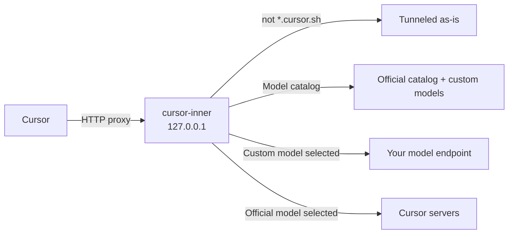

<div align="center">


# cursor-inner

Bring your own model endpoints into Cursor, alongside the official models.

[](https://github.com/CSGrandeur/cursor-inner/releases)
[](#limitations)
[](go.mod)
[](LICENSE)

[简体中文](README.md) · **English**

</div>

<picture>
  <source media="(prefers-color-scheme: dark)" srcset="docs/images/web-dark.png">
  
</picture>

> The settings page and console are currently in Chinese.

## Overview

cursor-inner is a local Windows tool. It runs a proxy on your machine that decrypts only `*.cursor.sh` traffic, and appends the OpenAI Chat or Anthropic compatible endpoints you configure to the end of Cursor's model list. When you pick one of those models in Cursor, your machine calls your endpoint directly. When you pick an official model, the request goes to Cursor unchanged.

## Features

- **Custom models**: OpenAI Chat Completions and Anthropic Messages endpoints. Add, test and delete them on the settings page.
- **Official models untouched**: the model catalog is only appended to, never replaced. Requests for official models are not modified, apart from going through your outbound proxy.
- **Connectivity test**: streams the numbers 1 to 120 and records tokens/s, time to first token, total duration and output tokens. The last result is saved with the model.
- **Outbound proxy**: route all of Cursor's network traffic through a socks5 or http proxy. Each custom model decides on its own whether to use it.
- **Takeover and restore**: on start, writes Cursor's proxy settings and closes Cursor. On normal exit, closing the window, a crash, or a forced kill, the settings are removed and Cursor is closed, so Cursor is never left pointing at a dead proxy.
- **Start at login**: a per-user Windows logon task. Toggling it repeatedly always leaves exactly one entry.
- **Single instance**: launching it again shows a notice and opens the existing settings page.

## How it works



On takeover, cursor-inner edits Cursor's `settings.json`: `http.proxy` points at the local proxy, `http.proxySupport` is set to `override`, and HTTP/2 is disabled.

The local proxy decrypts only connections to `*.cursor.sh`; everything else is tunneled directly. Chat requests are routed by model id: ids that belong to a custom model are handled locally, everything else is forwarded to Cursor unchanged.

## Quick start

1. Download `cursor-inner-<version>-windows-amd64.exe` from [Releases](https://github.com/CSGrandeur/cursor-inner/releases).
2. Run it. It closes any running Cursor and opens the settings page in your browser.
3. On first run, Windows asks whether to install the "cursor-inner Local CA" certificate. Choose Yes; without it Cursor cannot connect through the local proxy.
4. Add a model on the settings page: display name, type, model name, endpoint URL and API key. Click Test (测试) to check that it works.
5. Reopen Cursor, start a new chat, and pick the model you added from the model list.

> [!IMPORTANT]
> With **Auto** selected, Cursor only uses official models. Select a custom model explicitly to use it.

> [!NOTE]
> Release binaries are not code-signed. If Windows SmartScreen shows "Windows protected your PC", click "More info" → "Run anyway".

## Console window

The settings page URL stays pinned at the top of the console window and is never scrolled away by logs. In Windows Terminal, Ctrl+click the URL to open it.

```text
 ▌▐ cursor-inner v0.1.0   http://127.0.0.1:52341   Ctrl+单击打开配置页
    接管 ● 接管中    出站 socks5://127.0.0.1:1080    自定义模型 3
──────────────────────────────────────────────────────────────────────
20:31:07  接管代理 http://127.0.0.1:61022
20:31:07  已结束 Cursor，重新打开后生效
20:32:15  BidiAppend 3f2a9c… 模型 a1b2c3d4e5f60718 -> 本地
20:32:15  RunSSE 3f2a9c… 由本地模型 DeepSeek V4 Flash 回答
```

| Flag | Effect |
| --- | --- |
| `--no-takeover` | Starts only the settings page, without touching Cursor's settings or closing Cursor. For debugging. |

## Data and privacy

Everything is stored in `%APPDATA%\cursor-inner\`:

| File | Contents |
| --- | --- |
| `config.json` | Toggles, proxy address, custom models and their last test results. **API keys are stored in plain text.** |
| `ca\` | Root certificate and private key generated on this machine |
| `inner.log` | Routing log for the current run, rewritten on every start. Contains no chat content or keys. |
| `takeover.on` | Takeover marker used to restore Cursor's settings after an abnormal exit |
| `listen.url` | Current settings page URL, used by the single-instance notice |

cursor-inner collects no data: no telemetry, analytics or update checks. The settings page and the local proxy listen on `127.0.0.1` only. Chat content travels only between Cursor, your machine and the model endpoints you configure.

## Uninstall

1. Close the console window; Cursor's proxy settings are restored automatically. If you enabled start at login, turn it off on the settings page first.
2. Remove the root certificate: run `certutil -user -delstore Root "cursor-inner Local CA"`, or open `certmgr.msc` and delete "cursor-inner Local CA" under Trusted Root Certification Authorities → Certificates.
3. Delete the `%APPDATA%\cursor-inner\` folder and the exe.

## Limitations

- Windows 10 and 11 only. The code compiles on Linux and macOS, but takeover, certificate installation and start at login are implemented only for Windows.
- Custom models currently return text only and do not run tool calls. Use an official model when Agent mode needs to edit files or run commands.
- Tab completion and other features are still served by Cursor.
- If a Cursor update changes its internal protocol, custom models may stop working until cursor-inner is updated. Official models are not affected.

## Building from source

Requires Go 1.26 or later.

```bash
./build.sh windows                   # writes dist/cursor-inner.exe
VERSION=v0.1.0 ./build.sh windows    # stamps a version
go test ./...
```

For Windows amd64 builds, `build.sh` installs [rsrc](https://github.com/akavel/rsrc) to embed the icon into the exe.

| Script | Purpose |
| --- | --- |
| `scripts/make_icon.py` | Generates `assets/icon.svg` and `assets/icon.ico`; requires Pillow and ImageMagick |
| `scripts/gen_notices.sh` | Generates `THIRD_PARTY_NOTICES.md` from the built binary |

Pushing a `v*` tag makes GitHub Actions test, build and publish a release.

## Project layout

```text
cmd/cursor-inner/      Entry point: single instance, flags, exit cleanup
internal/
├── agent/             Decides per model id whether a chat runs locally or upstream
├── app/               Operations behind the settings page
├── autostart/         Windows logon task and Run key
├── catalog/           Entries appended to Cursor's model catalog
├── config/            Reads and writes config.json
├── console/           Pinned console header and log output
├── cursorsettings/    Edits Cursor's settings.json
├── dialer/            Direct or socks5 / http proxied dialing
├── mitm/              Local proxy: decrypts *.cursor.sh and routes requests
├── protox/            Connect frames and protobuf field encoding
├── provider/          Calls OpenAI Chat / Anthropic endpoints
├── takeover/          Certificate, closing Cursor, restore after abnormal exit
└── web/               Settings page and HTTP API
assets/                Icon
scripts/               Icon and third-party notice generators
```

## Acknowledgements

- [cursor-byok](https://github.com/leookun/cursor-byok): cursor-inner's handling of the Cursor protocol is based on its design.
- [goproxy](https://github.com/elazarl/goproxy), [sjson](https://github.com/tidwall/sjson) and the Go extended libraries.

License texts of all dependencies are in [THIRD_PARTY_NOTICES.md](THIRD_PARTY_NOTICES.md).

## Disclaimer

cursor-inner is an independent third-party project. It is not affiliated with, endorsed by, or authorized by Anysphere, Inc., the maker of Cursor. "Cursor" is a trademark of its owner.

This tool uses a local proxy to modify the model list received by the Cursor client and to intercept chat requests when a custom model is selected. This may not comply with Cursor's Terms of Service. You are responsible for reading and following the terms of Cursor and of the model providers you use, and for any consequences such as account restrictions. The software is provided "as is", without warranty of any kind.

## License

[MIT](LICENSE) © 2026 CSGrandeur
