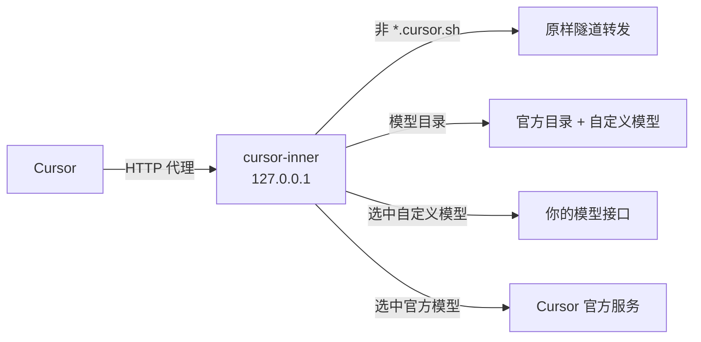

<div align="center">


# cursor-inner

在 Cursor 里接入自己的模型接口，官方模型照常使用。

[](https://github.com/CSGrandeur/cursor-inner/releases)
[](#限制)
[](go.mod)
[](LICENSE)

**简体中文** · [English](README.en.md)

</div>

<picture>
  <source media="(prefers-color-scheme: dark)" srcset="docs/images/web-dark.png">
  
</picture>

## 简介

cursor-inner 是一个 Windows 本地工具。它在本机启动一个只解密 `*.cursor.sh` 的代理，把你配置的 OpenAI Chat 或 Anthropic 兼容接口追加到 Cursor 的模型列表末尾。在 Cursor 里选中这些模型时，对话由本机直接调用你的接口；选官方模型时，请求原样发往 Cursor。

## 功能

- **自定义模型**：支持 OpenAI Chat Completions 和 Anthropic Messages 两种接口，在网页上添加、测试、删除。
- **官方模型不受影响**：模型目录只追加、不替换。官方模型的请求除了经过出站代理，不做任何改写。
- **连通性测试**：流式请求 1 到 120 的数字，记录 tokens/s、首字延迟、总耗时和输出 token 数。结果随配置保存，下次打开仍能看到。
- **出站代理**：Cursor 的全部联网可以走 socks5 或 http 代理；每个自定义模型可以单独设置是否走代理。
- **接管与还原**：启动时写入 Cursor 的代理设置并结束 Cursor。正常退出、关闭窗口、崩溃或进程被强制结束时，都会删掉这些设置并结束 Cursor，Cursor 不会卡在失效的代理上。
- **开机启动**：使用当前用户的 Windows 登录任务，反复开关始终只保留一条启动项。
- **单实例**：程序已在运行时再次打开，会弹窗提示，并打开已有的配置页。

## 工作原理



接管时，cursor-inner 修改 Cursor 的 `settings.json`：`http.proxy` 指向本机代理，`http.proxySupport` 设为 `override`，并关闭 HTTP/2。

本机代理只解密发往 `*.cursor.sh` 的连接，其余主机直接隧道转发。对话请求按模型 id 分流：属于自定义模型的由本地处理，其余原样转给官方。

## 快速开始

1. 从 [Releases](https://github.com/CSGrandeur/cursor-inner/releases) 下载 `cursor-inner-<版本>-windows-amd64.exe`。
2. 双击运行。程序会结束正在运行的 Cursor，并在浏览器里打开配置页。
3. 首次运行时，Windows 会询问是否安装「cursor-inner Local CA」证书，选「是」。不安装这张证书，Cursor 无法连接本机代理。
4. 在配置页添加模型：填写显示名、类型、模型名、接口地址和密钥，点「测试」确认能连通。
5. 重新打开 Cursor，新开一个对话，在模型列表里选择刚添加的模型。

> [!IMPORTANT]
> 选 **Auto** 时 Cursor 只使用官方模型。要使用自定义模型，必须在模型列表里手动选择。

> [!NOTE]
> 发布的 exe 没有代码签名。如果 Windows SmartScreen 提示「Windows 已保护你的电脑」，点「更多信息」→「仍要运行」。

## 命令行窗口

配置页地址固定在窗口顶部，不会被日志刷走。在 Windows Terminal 里按住 Ctrl 单击地址即可打开配置页。

```text
 ▌▐ cursor-inner v0.1.0   http://127.0.0.1:52341   Ctrl+单击打开配置页
    接管 ● 接管中    出站 socks5://127.0.0.1:1080    自定义模型 3
──────────────────────────────────────────────────────────────────────
20:31:07  接管代理 http://127.0.0.1:61022
20:31:07  已结束 Cursor，重新打开后生效
20:32:15  BidiAppend 3f2a9c… 模型 a1b2c3d4e5f60718 -> 本地
20:32:15  RunSSE 3f2a9c… 由本地模型 DeepSeek V4 Flash 回答
```

| 参数 | 作用 |
| --- | --- |
| `--no-takeover` | 不修改 Cursor 设置，也不结束 Cursor，只启动配置页。用于调试。 |

## 数据与隐私

所有数据保存在 `%APPDATA%\cursor-inner\`：

| 文件 | 内容 |
| --- | --- |
| `config.json` | 各项开关、代理地址、自定义模型和上次测试结果。**API 密钥以明文保存。** |
| `ca\` | 本机生成的根证书和私钥 |
| `inner.log` | 本次运行的分流日志，每次启动时重写。不记录对话内容和密钥。 |
| `takeover.on` | 接管标记，用于异常退出后还原 Cursor 设置 |
| `listen.url` | 当前配置页地址，用于单实例提示 |

cursor-inner 不收集任何数据，没有遥测、统计或自动更新请求。配置页和本机代理只监听 `127.0.0.1`。对话内容只在 Cursor、本机和你配置的模型接口之间传递。

## 卸载

1. 关闭命令行窗口，Cursor 的代理设置会自动还原。如果开过开机启动，先在配置页关掉。
2. 删除根证书：执行 `certutil -user -delstore Root "cursor-inner Local CA"`；或打开 `certmgr.msc`，在「受信任的根证书颁发机构 → 证书」里删除「cursor-inner Local CA」。
3. 删除 `%APPDATA%\cursor-inner\` 目录和 exe。

## 限制

- 只支持 Windows 10 和 11。代码可以在 Linux、macOS 上编译，但接管、证书安装和开机启动只在 Windows 上实现。
- 自定义模型目前只返回文本，不执行工具调用。在 Agent 模式下需要读写文件或运行命令时，请使用官方模型。
- Tab 补全等其余功能仍由 Cursor 官方服务提供。
- Cursor 升级后如果改动了内部协议，自定义模型可能暂时不可用；官方模型不受影响。

## 从源码构建

需要 Go 1.26 或更新版本。

```bash
./build.sh windows                   # 输出 dist/cursor-inner.exe
VERSION=v0.1.0 ./build.sh windows    # 写入版本号
go test ./...
```

构建 Windows amd64 版本时，`build.sh` 会自动安装 [rsrc](https://github.com/akavel/rsrc)，用来把图标写进 exe。

| 脚本 | 用途 |
| --- | --- |
| `scripts/make_icon.py` | 生成 `assets/icon.svg` 和 `assets/icon.ico`，需要 Pillow 和 ImageMagick |
| `scripts/gen_notices.sh` | 根据编译产物生成 `THIRD_PARTY_NOTICES.md` |

推送 `v*` 标签后，GitHub Actions 会自动测试、编译并发布 Release。

## 项目结构

```text
cmd/cursor-inner/      程序入口：单实例、命令行参数、退出清理
internal/
├── agent/             按模型 id 决定对话走本地还是官方
├── app/               配置页用到的各项操作
├── autostart/         Windows 登录任务与注册表启动项
├── catalog/           生成追加到 Cursor 模型目录里的条目
├── config/            读写 config.json
├── console/           命令行窗口的固定顶栏和日志
├── cursorsettings/    修改 Cursor 的 settings.json
├── dialer/            直连或经 socks5 / http 代理拨号
├── mitm/              本机代理：解密 *.cursor.sh 并分流
├── protox/            Connect 帧与 protobuf 字段读写
├── provider/          调用 OpenAI Chat / Anthropic 接口
├── takeover/          证书、结束 Cursor、异常退出后的还原
└── web/               配置页与 HTTP API
assets/                图标
scripts/               图标与第三方声明生成脚本
```

## 致谢

- [cursor-byok](https://github.com/leookun/cursor-byok)：cursor-inner 的 Cursor 协议处理参考了它的设计。
- [goproxy](https://github.com/elazarl/goproxy)、[sjson](https://github.com/tidwall/sjson) 和 Go 官方扩展库。

各依赖的许可证原文见 [THIRD_PARTY_NOTICES.md](THIRD_PARTY_NOTICES.md)。

## 免责声明

cursor-inner 是独立的第三方项目，与 Anysphere, Inc.（Cursor 的开发商）没有关联，也未获得其认可或授权。「Cursor」是其所有者的商标。

本工具通过本机代理改写 Cursor 客户端收到的模型列表，并在选中自定义模型时拦截对话请求。这种做法可能不符合 Cursor 的服务条款。使用者应自行阅读并遵守 Cursor 以及所用模型服务商的条款，并自行承担账号受限等后果。本软件按「原样」提供，不附带任何担保。

## 许可证

[MIT](LICENSE) © 2026 CSGrandeur
