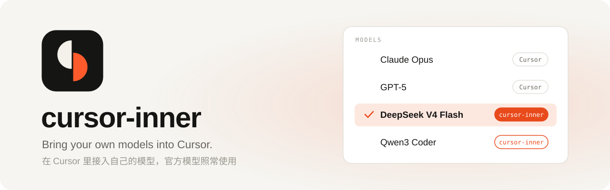
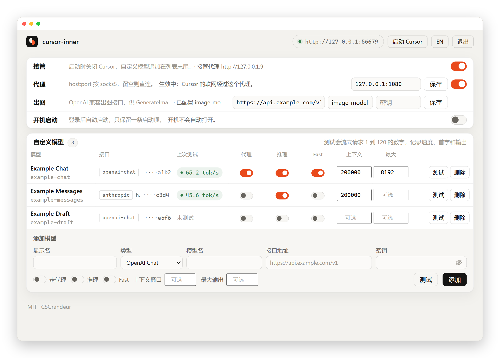
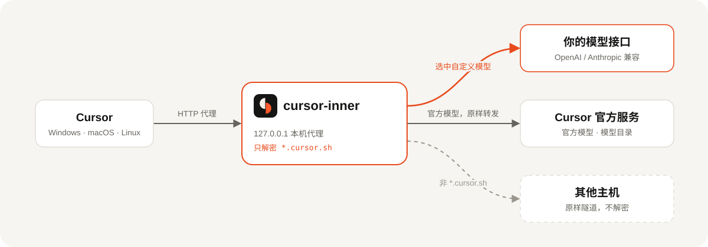

<p align="center">
  <picture>
    <source media="(prefers-color-scheme: dark)" srcset="docs/images/banner-dark.svg">
    
  </picture>
</p>

<p align="center">
  <a href="https://github.com/CSGrandeur/cursor-inner/releases/latest"></a>
  <a href="#安装"></a>
  <a href="go.mod"></a>
  <a href="LICENSE"></a>
</p>

<p align="center">
  <b>简体中文</b> · <a href="README.en.md">English</a>
  <br>
  <a href="#安装">安装</a> · <a href="#功能">功能</a> · <a href="#工作原理">工作原理</a> · <a href="#常见问题">常见问题</a>
</p>

<br>

cursor-inner 是一个本地小工具。它把你配置的 OpenAI Chat 或 Anthropic 兼容接口加进 Cursor 的模型列表：选中这些模型时，对话由本机直接调用你的接口；选官方模型时，请求原样发往 Cursor。支持 Windows、macOS 和 Linux 版的 Cursor，配置页提供中文和英文界面。

<p align="center">
  <picture>
    <source media="(prefers-color-scheme: dark)" srcset="docs/images/window-zh-dark.png">
    
  </picture>
</p>

## 功能

<table>
  <tr>
    <td width="33%" valign="top">
      <b>自定义模型</b><br>
      OpenAI Chat Completions 和 Anthropic Messages 两种接口，在网页上添加、测试、删除，追加在 Cursor 模型列表末尾。
    </td>
    <td width="33%" valign="top">
      <b>官方模型照常</b><br>
      模型目录只追加、不替换。官方模型的请求除了经过出站代理，不做任何改写。
    </td>
    <td width="33%" valign="top">
      <b>连通性测试</b><br>
      流式请求 1 到 120 的数字，记录 tokens/s、首字延迟、总耗时和输出 token 数，结果随配置保存。
    </td>
  </tr>
  <tr>
    <td width="33%" valign="top">
      <b>出站代理</b><br>
      Cursor 的全部联网可以走 socks5 或 http 代理；每个自定义模型单独决定是否走代理。
    </td>
    <td width="33%" valign="top">
      <b>可靠还原</b><br>
      退出、关闭终端、崩溃或被强制结束时，都会撤掉接管设置，并把你原有的 <code>http.proxy</code> 等设置写回。
    </td>
    <td width="33%" valign="top">
      <b>三个平台</b><br>
      Windows、macOS、Linux 都能接管、信任证书和开机启动；单实例运行，配置页可切换中文和英文。
    </td>
  </tr>
</table>

## 安装

**macOS / Linux**

```bash
curl -fsSL https://raw.githubusercontent.com/CSGrandeur/cursor-inner/main/install.sh | sh
```

**Windows**（PowerShell）

```powershell
irm https://raw.githubusercontent.com/CSGrandeur/cursor-inner/main/install.ps1 | iex
```

安装脚本自动识别系统和 CPU 架构，下载最新版本，按 Release 里的 `SHA256SUMS.txt` 校验后装到当前用户目录，不需要管理员权限。用脚本下载的程序不带浏览器的下载标记，SmartScreen 和 Gatekeeper 不会拦截。指定版本可以设置环境变量 `CURSOR_INNER_VERSION=v0.1.0`。

<details>
<summary><b>装到了哪里</b></summary>

| 平台 | 安装位置 | 启动方式 |
| --- | --- | --- |
| Windows | `%LOCALAPPDATA%\Programs\cursor-inner\` | 开始菜单里的 cursor-inner |
| macOS | `~/.local/bin/cursor-inner` | 在终端运行 `cursor-inner` |
| Linux | `~/.local/bin/cursor-inner` | 应用菜单里的 cursor-inner，或在终端运行 |

</details>

<details>
<summary><b>首次运行：信任本机证书</b></summary>

首次接管时，cursor-inner 会生成一张只属于本机的根证书「cursor-inner Local CA」，并请求系统信任它。不信任这张证书，Cursor 无法连接本机代理。

| 平台 | 会看到什么 |
| --- | --- |
| Windows | 弹窗询问是否安装证书，选「是」 |
| macOS | 要求输入登录密码，把证书写入登录钥匙串并设为受信任 |
| Linux | 弹出 polkit 授权框，授权后写入系统证书库；缺少 `certutil` 时在同一次授权里自动安装 |

Linux 上证书写入两处：系统证书库，以及 NSS 用户库 `~/.pki/nssdb`。系统证书库支持 Debian / Ubuntu、Fedora / RHEL、openSUSE 和 Arch 等使用 p11-kit 的发行版。没有图形界面或没有 `pkexec` 时，配置页和终端会给出可直接复制执行的 `sudo` 命令。关闭 Cursor 需要 `pgrep` / `pkill`（procps，各发行版通常自带）。

</details>

<details>
<summary><b>手动下载</b></summary>

从 [Releases](https://github.com/CSGrandeur/cursor-inner/releases/latest) 下载：

| 平台 | 文件 |
| --- | --- |
| Windows 10 / 11 | `cursor-inner-<版本>-windows-amd64.exe` |
| macOS（Apple 芯片 / Intel） | `cursor-inner-<版本>-darwin-arm64.tar.gz` / `darwin-amd64.tar.gz` |
| Linux（x86_64 / ARM64） | `cursor-inner-<版本>-linux-amd64.tar.gz` / `linux-arm64.tar.gz` |

浏览器下载的文件带有下载标记。Windows 上 SmartScreen 提示时，点「更多信息」→「仍要运行」；macOS 上先执行 `xattr -d com.apple.quarantine cursor-inner` 再运行。每个版本附带 `SHA256SUMS.txt` 和 SPDX 格式的 SBOM。

</details>

## 使用

1. 运行 cursor-inner。它会关闭正在运行的 Cursor，并在浏览器里打开配置页。
2. 添加模型：填写显示名、类型、模型名、接口地址和密钥，点「测试」确认能连通。
3. 重新打开 Cursor，新开一个对话，在模型列表里选择刚添加的模型。
4. 用完后关闭终端窗口，或在配置页点「退出」。Cursor 的设置会自动还原。

> [!IMPORTANT]
> 选 **Auto** 时 Cursor 只使用官方模型。要使用自定义模型，必须在模型列表里手动选择。

## 工作原理

<p align="center">
  <picture>
    <source media="(prefers-color-scheme: dark)" srcset="docs/images/flow-zh-dark.svg">
    
  </picture>
</p>

接管时，cursor-inner 修改 Cursor 的 `settings.json`：`http.proxy` 指向本机代理，`http.proxySupport` 设为 `override`，并关闭 HTTP/2。原有的同名设置先备份，还原时写回。

本机代理只解密发往 `*.cursor.sh` 的连接，其余主机直接隧道转发。对话请求按模型 id 分流：属于自定义模型的由本地处理，其余原样转给官方。

## 命令行窗口

配置页地址固定在窗口顶部，不会被日志刷走。按回车即可打开配置页；在支持超链接的终端里（Windows Terminal、iTerm2、GNOME Terminal 等），也可以按住 Ctrl 或 Cmd 单击地址。

```text
 ▌▐ cursor-inner v0.1.0   http://127.0.0.1:52341   按回车打开配置页
    接管 ● 接管中    出站 socks5://127.0.0.1:1080    自定义模型 3
──────────────────────────────────────────────────────────────────────
20:31:07  接管代理 http://127.0.0.1:61022
20:31:07  已结束 Cursor，重新打开后生效
20:32:15  BidiAppend 3f2a9c… 模型 a1b2c3d4e5f60718 -> 本地
20:32:15  RunSSE 3f2a9c… 由本地模型 DeepSeek V4 Flash 回答
```

在 Windows 上从资源管理器、开始菜单或开机启动打开时，cursor-inner 使用经典控制台窗口，任务栏显示它自己的图标；在已有的终端里输入命令启动时，仍在原终端里运行。加 `--no-takeover` 参数启动时，只打开配置页，不修改 Cursor 设置，也不关闭 Cursor，用于调试。

## 常见问题

<details>
<summary><b>选了 Auto，为什么没用到我的模型？</b></summary>

Auto 由 Cursor 官方服务决定用哪个模型，只会在官方模型中选择。要使用自定义模型，在模型列表里手动选中它。

</details>

<details>
<summary><b>自定义模型能读写文件、运行命令吗？</b></summary>

目前不能。自定义模型只返回文本，不执行工具调用。Agent 模式下需要读写文件或运行命令时，请使用官方模型。Tab 补全等其余功能仍由 Cursor 官方服务提供。

</details>

<details>
<summary><b>API 密钥和其他数据存在哪里？</b></summary>

| 平台 | 数据目录 |
| --- | --- |
| Windows | `%APPDATA%\cursor-inner\` |
| macOS | `~/Library/Application Support/cursor-inner/` |
| Linux | `~/.config/cursor-inner/`（或 `$XDG_CONFIG_HOME/cursor-inner/`） |

| 文件 | 内容 |
| --- | --- |
| `config.json` | 各项开关、代理地址、自定义模型和上次测试结果。**API 密钥以明文保存**，文件只有当前用户可读。 |
| `ca/` | 本机生成的根证书和私钥 |
| `cursor-settings.backup.json` | 接管期间 Cursor 原有代理设置的备份，还原后删除 |
| `inner.log` | 本次运行的分流日志，每次启动时重写，不记录对话内容和密钥 |
| `watch.log` | 异常退出后自动还原的记录 |
| `takeover.on`、`listen.url`、`instance.lock` | 接管标记、当前配置页地址、单实例锁 |

cursor-inner 不收集任何数据，没有遥测、统计或自动更新请求。配置页和本机代理只监听 `127.0.0.1`。对话内容只在 Cursor、本机和你配置的模型接口之间传递。

</details>

<details>
<summary><b>cursor-inner 意外退出，Cursor 会连不上网吗？</b></summary>

不会。接管期间有一个独立的守护进程盯着主进程，主进程崩溃或被强制结束后，它会撤掉接管设置、写回你原来的代理设置，并关闭 Cursor，重新打开 Cursor 即可正常使用。

</details>

<details>
<summary><b>Cursor 升级后还能用吗？</b></summary>

官方模型不受影响。如果 Cursor 改动了内部协议，自定义模型可能暂时不可用，需要等 cursor-inner 更新。

</details>

<details>
<summary><b>怎么卸载？</b></summary>

1. 如果开过开机启动，先在配置页关掉。然后点「退出」，Cursor 的设置会自动还原。
2. 删除根证书：

   | 平台 | 命令 |
   | --- | --- |
   | Windows | `certutil -user -delstore Root "cursor-inner Local CA"` |
   | macOS | `security delete-certificate -c "cursor-inner Local CA" ~/Library/Keychains/login.keychain-db` |
   | Linux（NSS） | `certutil -d sql:$HOME/.pki/nssdb -D -n "cursor-inner Local CA"` |
   | Debian / Ubuntu | `sudo rm /usr/local/share/ca-certificates/cursor-inner.crt && sudo update-ca-certificates --fresh` |
   | Fedora / RHEL | `sudo rm /etc/pki/ca-trust/source/anchors/cursor-inner.pem && sudo update-ca-trust` |
   | Arch 等 | `sudo trust anchor --remove ~/.config/cursor-inner/ca/ca.crt` |

3. 删除数据目录和程序文件。用安装脚本装的，还要删除开始菜单里的 `cursor-inner.lnk`（Windows），或 `~/.local/share/applications/cursor-inner.desktop` 和 `~/.local/share/icons/hicolor/scalable/apps/cursor-inner.svg`（Linux）。

</details>

<details>
<summary><b>程序有代码签名吗？</b></summary>

没有。用安装脚本安装不会被系统拦截；从浏览器下载时需要按「手动下载」里的说明放行。终端窗口里的提示目前只有中文。

</details>

## 参与开发

需要 Go 1.26 或更新版本。

```bash
go test ./...
./build.sh windows                   # 输出 dist/cursor-inner.exe
./build.sh darwin arm64              # 输出 dist/cursor-inner-darwin-arm64
VERSION=v0.1.0 ./build.sh linux      # 写入版本号
```

构建 Windows amd64 版本时，`build.sh` 会自动安装 [rsrc](https://github.com/akavel/rsrc)，用来把图标写进 exe。推送 `v*.*.*` 标签后，GitHub Actions 会测试、编译五个平台的版本，并按 [CHANGELOG.md](CHANGELOG.md) 里的对应条目发布 Release。

<details>
<summary><b>项目结构</b></summary>

```text
cmd/cursor-inner/      程序入口：单实例、命令行参数、弹窗、窗口图标、退出清理
internal/
├── agent/             按模型 id 决定对话走本地还是官方
├── app/               配置页用到的各项操作
├── autostart/         开机启动：Windows 登录任务、macOS LaunchAgent、Linux XDG 自动启动
├── catalog/           生成追加到 Cursor 模型目录里的条目
├── config/            读写 config.json
├── console/           命令行窗口的固定顶栏和日志
├── cursorsettings/    修改并还原 Cursor 的 settings.json
├── dialer/            直连或经 socks5 / http 代理拨号
├── i18n/              配置页用到的中英双语文本
├── mitm/              本机代理：解密 *.cursor.sh 并分流
├── protox/            Connect 帧与 protobuf 字段读写
├── provider/          调用 OpenAI Chat / Anthropic 接口
├── takeover/          接管与还原、根证书、关闭 Cursor、异常退出后的守护进程
└── web/               配置页与 HTTP API
assets/                图标
docs/images/           README 用图
install.sh             macOS / Linux 安装脚本
install.ps1            Windows 安装脚本
scripts/
├── make_icon.py       生成 assets/icon.svg 和 icon.ico（需要 Pillow、ImageMagick）
├── make_readme_art.py 生成 README 横幅、原理图和截图外框（需要 Pillow）
└── gen_notices.sh     根据编译产物生成 THIRD_PARTY_NOTICES.md
```

</details>

## 致谢

- [cursor-byok](https://github.com/leookun/cursor-byok)：cursor-inner 的 Cursor 协议处理参考了它的设计。
- [goproxy](https://github.com/elazarl/goproxy)、[gjson / sjson](https://github.com/tidwall/sjson) 和 Go 官方扩展库。各依赖的许可证原文见 [THIRD_PARTY_NOTICES.md](THIRD_PARTY_NOTICES.md)。

## 免责声明

cursor-inner 是独立的第三方项目，与 Anysphere, Inc.（Cursor 的开发商）没有关联，也未获得其认可或授权。「Cursor」是其所有者的商标。

本工具通过本机代理改写 Cursor 客户端收到的模型列表，并在选中自定义模型时拦截对话请求。这种做法可能不符合 Cursor 的服务条款。使用者应自行阅读并遵守 Cursor 以及所用模型服务商的条款，并自行承担账号受限等后果。本软件按「原样」提供，不附带任何担保。

---

<p align="center">
  <br>
  <sub><a href="LICENSE">MIT</a> © 2026 CSGrandeur · <a href="CHANGELOG.md">更新日志</a> · <a href="SECURITY.md">安全策略</a></sub>
</p>
